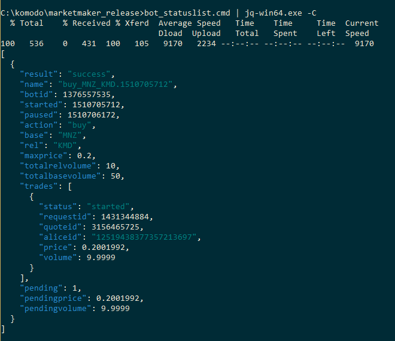

## DexScripts for Windows. How to use? ##

**1.** Before start you should put scripts and following binaries into one folder:
 
- curl.exe (required for all scripts)
- marketmaker.exe
- libcurl.dll (required to run marketmaker)
- nanomsg.dll (required to run marketmaker)

**2.** Don't forget to put `coins.json` file into a same folder. This file is available it this repo.

**3.** Type your passphrase into passphrase file in this folder (you should create file with name `passphrase` and without extension) and run `1-client.cmd`. This will run marketmaker. Next step is to obtain userpass needed for other scripts, you can simply copy and paste it from marketmaker output on startup into userpass file. 

Or run `2-getuserpass.cmd` to fill userpass file automatically.** NB!** To get userpass you shouldn't run any scripts between 1-client.cmd and 2-getuserpass.cmd launching.

Sample output of correct `2-getuserpass.cmd` usage is:

You should see your userpass on screen, and after it will automatically copied in userpass file. It's important to all other scripts to have this password in userpass file. If output of `2-getuserpass.cmd` is not same as showed on screen above - wait some seconds and run `2-getuserpass.cmd` again. Also make sure that you have allowed marketmaker to accept incoming connections in your Windows Firewall (first time launched system should automatically asked for it).

**4.** For using other scripts please refer to barterDEX API. Or **barterDEX API Summary by Category** document by *shossain*.  

## Scripts List ##

**NB!** Before you use any script that do some actions with your coins (for example, withdraw and others) **edit it** and make sure that it have correct addresses, coin name and volumes inside. Don't run any scripts without looking on it's source and clearly understanding what it does.

* **1-client.cmd** - used to start Marketmaker. Make sure you already have filled a strong passphrase into `passphrase` file as described above.
* **2-getuserpass.cmd** - fills userpass in `userpass` file. this step needed to use any other scripts.
* **balance.cmd** - displays current balance of selected coin.
* **enable.cmd** - enables a selected coin for trading.
* **getcoin.cmd** - prints information about a selecting coin:

    {"result":"success","enabled":2,"disabled":70,"coin":{"coin":"KMD","installed":true,"height":580716,"balance":72.68774305,"KMDvalue":72.68774305,"status":"active","electrum":"electrum.cipig.net:10001","smartaddress":"RTCVGuoSNehKG8YYxcoskC7LK1yZhgvQRV","rpc":"127.0.0.1:7771","pubtype":60,"p2shtype":85,"wiftype":188,"txfee":10000}}

* **getutxos.cmd** - seems alredy deprecated.
* **inventory.cmd** - prints your inventory.
* **listunspent.cmd** - prints your utxos.
* **orderbook.cmd** - prints base/rel orderbook.
* **portfolio.cmd** - prints porfolio information.
* **snapshot.cmd** - ...
* **electrum.cmd** - allows you to run coins in electum mode (!), example includes two coins - KMD and MNZ. if you need to run more coins in electrum mode, add needed electrum servers from here - [http://pad.supernet.org/electrum-servers](http://pad.supernet.org/electrum-servers).
* **help.cmd** - displays help about all available API commands.
* **bot_buy.cmd** - launches bot for buying. you'll need to set base and rel coin in script, and also maxprice and relvolume.
* **bot_list.cmd** - lists id of all running bots.
* **bot_statuslist.cmd** - list statuses of all running bots.
* **bot_stop.cmd** - stopt the bot with given bot_id.
* **withdraw.cmd** - example of withdraw method. you can send coins from your smartaddress to any other address using widthraw. as a result method generates signed raw tx in hex, which you can use with sendrawtransaction.cmd . remember, that withdraw only *prepares* transaction, but it doesn't broadcast (send) it to network. after tx is prepared we need to send it using sendrawtransaction method.
* **sendrawtransaction.cmd** - sends raw transaction. you'll need a signedtx in hex. 
* **withdraw_send.cmd** - combines withdraw and send raw tx scripts. you can call it `send`, just specify coin, volume and addresses to which you wan send coins and it will prepare and broadcast transaction automatically.
* **withdraw_10_send.cmd** - example of inventory split: this split 10 KMD from your balance to Alice inventory in 10 utxos pairs (1.002, 0.00386871). Strongly recommended to read [http://pad.supernet.org/barterdex-readme](http://pad.supernet.org/barterdex-readme) -> UTXO PAIRS to understand the basics. This script is just for example how you can split your coins in  (X, X/777) to start trading them.

## F.A.Q. ##

**Q.** Is any simple way how i can display JSON results returned by all scripts, like orderbook and others, in human readable form?

**A.** Yes, you can use this service [JSON Editor Online](http://jsoneditoronline.org/), just copy and paste output of script in left column and see structured output in right.

**Q.** I see an output like this when i'm start `1-client.cmd` :

    bind(0.0.0.0) port.7783 failed: No error sock.1468. errno.0
    bind(0.0.0.0) port.7783 failed: No error sock.1516. errno.0
    bind(0.0.0.0) port.7783 failed: No error sock.1444. errno.0
    bind(0.0.0.0) port.7783 failed: No error sock.1484. errno.0
    bind(0.0.0.0) port.7783 failed: No error sock.1412. errno.0
    bind(0.0.0.0) port.7783 failed: No error sock.1524. errno.0
    bind(0.0.0.0) port.7783 failed: No error sock.1008. errno.0

And nothing works.

**A.** Before run `1-client.cmd` make sure in Task Manager that you haven't already running `marketmaker.exe`. If have - kill this process via Task Manager or via command line command `taskkill /f /im taskkill.exe` .

**Q.** How can i pretty print JSON answers of marketmaker?

**A.** You can get best results with 2 tools - [conemu](https://conemu.github.io/) and [jq](https://stedolan.github.io/jq/), conemu supports ANSI X3.64 and Xterm 256 colors and jq allow you to pretty-print json output with colors, like this:

Also i'm always recommend to install [Far Manager](https://www.farmanager.com/index.php?l=en) - this is powerful console file manager for Windows, like Midnight Commander in *nix.

**Q.** What additional dependencies required by marketmaker?

**A.** Currently marketmaker (Windows) used the following DLLs:

*32 bit:*
- libcrypto-1_1.dll
- libcurl.dll
- libssl-1_1.dll
- nanomsg.dll
- pthreadvc2.dll

*64-bit:*
- libcurl.dll
- nanomsg.dll

It already included in repo and in archive with release.