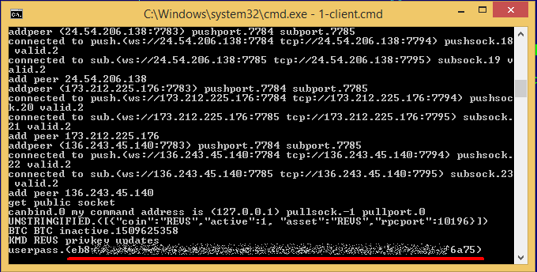
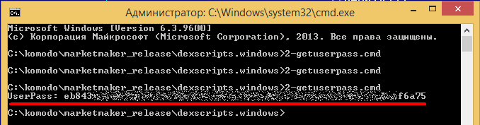

## DexScripts for Windows. How to use? ##

**1.** Before start you should put scripts and following binaries into one folder:
 
- curl.exe (required for all scripts)
- marketmaker.exe
- libcurl.dll (required to run marketmaker)
- nanomsg.dll (required to run marketmaker)

**2.** Don't forget to put `coins.json` file into a same folder. This file is available it this repo.

**3.** Type your passphrase into passphrase file in this folder (you should create file with name `passphrase` and without extension) and run `1-client.cmd`. This will run marketmaker. Next step is to obtain userpass needed for other scripts, you can simply copy and paste it from marketmaker output on startup into userpass file. 

Or run `2-getuserpass.cmd` to fill userpass file automatically.** NB!** To get userpass you shouldn't run any scripts between 1-client.cmd and 2-getuserpass.cmd launching.

Sample output of correct `2-getuserpass.cmd` usage is:

You should see your userpass on screen, and after it will automatically copied in userpass file. It's important to all other scripts to have this password in userpass file. If output of `2-getuserpass.cmd` is not same as showed on screen above - wait some seconds and run `2-getuserpass.cmd` again. Also make sure that you have allowed marketmaker to accept incoming connections in your Windows Firewall (first time launched system should automatically asked for it).

**4.** For using other scripts please refer to barterDEX API. Or **barterDEX API Summary by Category** document by *shossain*.  
